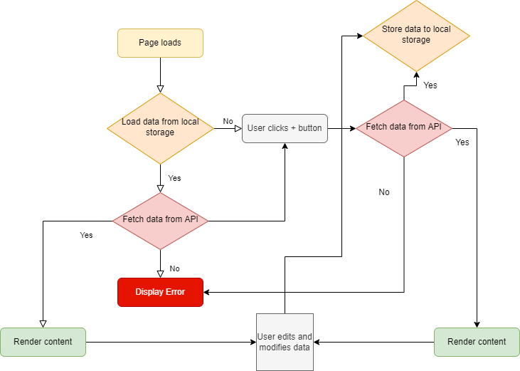
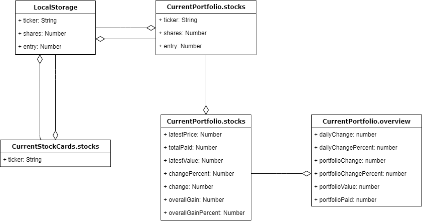
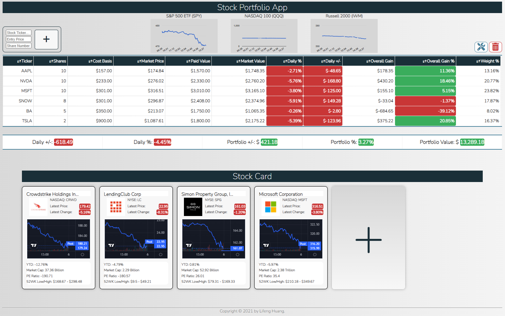

# stock-portfolio-manager

### This application allows you to create and track a portfolio of stocks with real time quotes and your return on investment. It also has a stock card section where you can use it as watch list.

### ATTENTION: This application currently uses a free-tier API, if data is not showing up on the app, it is likely the monthly limit has been reached.

#### App description and functionalities: Users can start by adding a stock by its ticker symbol, along with number of shares and cost basis for that stock to the portfolio. The app will fetch real time data and generate the portfolio table. After stocks are added to the portfolio table. The user can modify individual stock by clicking the Edit button. The user can then edit stock ticker name, cost basis, share number on the table. The user will also be able to delete any row from the table. The table comes with sorting functions on each column headers, user can sort ascending and descending order.

#### The user can add watch list stock in the stock card section. A stock card will display more details about a stock along with a stock chart. Finally, the user can delete a stock card by hovering it and clicking the delete button.

### Application Flowchart

### Application Data Storage Setup and Architecture

### Application Interface

